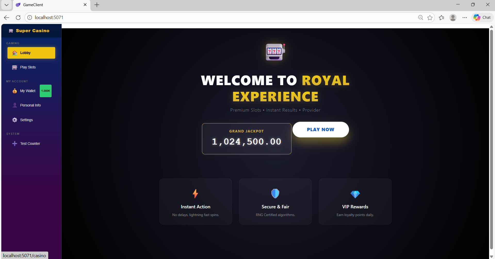

# Slot Machine Simulation – Full Stack .NET 8

**Note:** This is a technical simulation/demo project. It does not involve real money and is intended for learning or demonstration purposes only.

A Full-Stack Slot Machine technical demo built with .NET 8, demonstrating a Remote Game Server (RGS) architecture, with clear separation between client-side UI and server-side game logic.

---

## Tech Stack

| Component | Technology | Details |
| :--- | :--- | :--- |
| **Frontend** | Blazor WebAssembly (WASM) | Client-side simulation and UI |
| | C# | State management and interactions |
| | Custom CSS | No external UI libraries used |
| **Backend** | ASP.NET Core Web API | RESTful API endpoints |
| | Server Logic | Server-side game logic and RNG (Random Number Generator) |
| **Language** | C# (.NET 8) | - |
| **Session** | Simulated | Simulated session management (for demo purposes only) |

## Application Structure

The application is divided into two main areas:

### 1. Lobby (`/`)
* Entry point and landing page.
* Displays branding, promotional banners, and navigation to game areas.

### 2. Game Room (`/casino`)
* Hosts the Slot Machine component.
* Establishes connection with the RGS Server to fetch simulated results.

---

## Data Flow (Simulation Logic)

The primary interaction follows this flow:

1.  User clicks the "SPIN" button.
2.  Client sends a POST request to `api/casino/spin` with the simulated bet amount.
3.  RGS Server executes the RNG to determine reel symbols and calculates simulated wins.
4.  Server responds with JSON containing:
    * Reel positions
    * Simulated win amount
    * Simulated balance
5.  Client receives the response and updates UI accordingly (animations, balance display).

> **Important:** All values are simulated for demo purposes only. No real money is involved.

---

## Production Considerations (for real-money systems)

In a real-world environment, additional security and architecture would be required:

* **State Management:** Client session state should never be trusted. Balances are always stored securely on the server.
* **Database:** Use a transactional database (SQL Server/PostgreSQL) for ACID compliance.
* **Authentication:** JWT/OAuth to secure endpoints and identify users.
* **RNG:** Replace .NET Random with a certified Cryptographically Secure PRNG for fair gameplay.
* **Logging & Audit:** All transactions and game results logged server-side.
* **Rate Limiting & Security:** To prevent abuse and ensure system stability.

This project is for educational and demonstration purposes only. It does not promote or handle real gambling.

